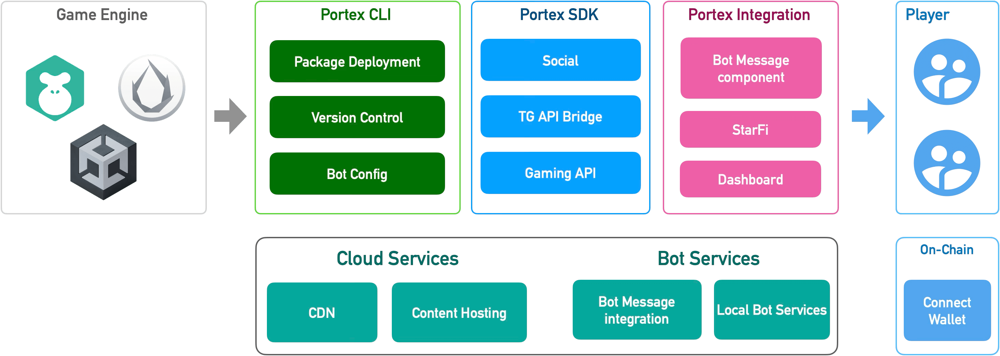
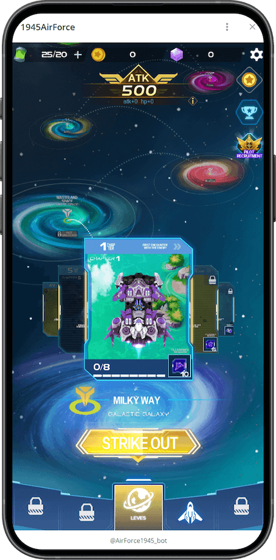
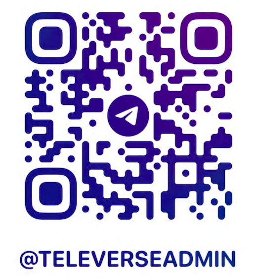

  <a href="en/README.md">English</a> | <a href="cn/README.md">中文</a>

# Introduction

## What is Portex?

Portex integrates Bot-as-a-Service for **one-click mini-game deployment** to mutiple platforms, reducing over 90% of cross-platform compatiability work.

## Benefits

* Easy to launch mini-game, low learning curve
* Seamless integration with Telegram, and more platforms
* Blockchain integration, friend referrals system, Telegram StarFi and etc. \

## Key Features

* **One-click Deployment**: Deploy mini-games across multiple platforms with a single click, reducing distribution costs.
* **Bot as a Service**: Seamless community management service for games, enabling automated user engagement.
* **Web3 Gaming**: Integrate decentralized identity verification and digital wallet functionalities for secure authentication and seamless transactions.
* **Monetization**: StarFi integration for in-game purchases & and withdrawl
* **Gameplay Features**: Leaderboard, GameSave, and more. (Coming soon)

## Showcase

<figure><figcaption>
<strong>AirForce 1945</strong>
</figcaption></figure> <figure><figcaption>
<strong>Mini Football Game</strong>
</figcaption></figure> <figure><figcaption>
<strong>Mad Wheels</strong>
</figcaption></figure>

* **AirForce 1945** [https://t.me/AirForce1945\_bot/game](https://t.me/AirForce1945_bot/game)
* **Mini Football** [https://t.me/miniFootballgame\_bot?startapp=portex](https://t.me/miniFootballgame_bot?startapp=portex)
* **MadWheels** [https://t.me/MadWheels\_bot](https://t.me/MadWheels_bot)

🎮 [Show me more...](getting-started/showcase.md)

## How It Works?

1. First, use [portex cli](en/cli/overview.md) to create a new mini-game, deploy it, and publish it.
2. Integrate [portex sdk](en/sdk/overview.md) to develop your mini-game.

See more details in [Workflow](en/getting-started/workflow.md)

## Contact us

<figure><figcaption></figcaption></figure>

[https://www.televerse.xyz/](https://www.televerse.xyz/)

[https://t.me/televerseadmin](https://t.me/televerseadmin)

[https://x.com/televerseXYZ](https://x.com/televerseXYZ)

[https://github.com/portex-app](https://github.com/portex-app)

[mailto:official@teletypes.io](mailto:official@teletypes.io)
