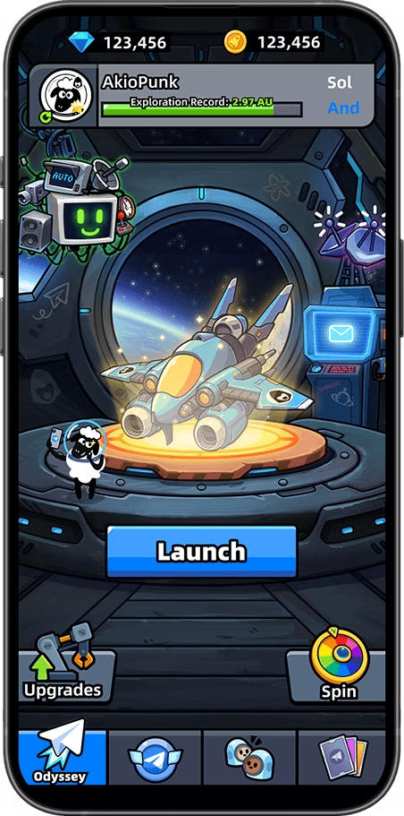
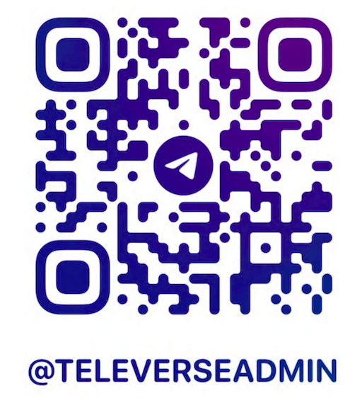

# Introduction

## Introduction to Portex

Portex integrates Bot-as-a-Service for **one-click mini-game deployment** to mutiple platforms, reducing over 90% of cross-platform compatiability work.

## Benefits

* Easy to launch mini-game, low learning curve
* Seamless integration with Telegram, and more platforms
* Integration with Web3, Social Invite, StarFi, etc.

## Key Features

* **One-click Deployment**: Deploy mini-games across multiple platforms with a single click, reducing distribution costs.
* **Bot as a Service**: Seamless community management service for games, enabling automated user engagement.
* **Web3 Gaming**: Integrate decentralized identity verification and digital wallet functionalities for secure authentication and seamless transactions.
* **Commercialization**: StarFi integration for in-game purchases & Social Invite for community growth.
* **Gameplay Features**: Leaderboard, GameSave, and more. (Coming soon)

## Show Case

<figure><figcaption></figcaption></figure> <figure><figcaption></figcaption></figure> <figure><figcaption></figcaption></figure>

* **GameVa** [https://www.gameva.ai/](https://www.gameva.ai/)
* **Televerse Odyssey** [https://t.me/TeleverseOdyssey\_bot/game](https://t.me/TeleverseOdyssey_bot/game)
* **MadWheels** [https://t.me/MadWheels\_bot/game](https://t.me/MadWheels_bot/game)

## How to use

1. first, use [portex cli](cli/overview.md) to create a new mini-game, deploy it, and publish it.
2. then, integrate [portex sdk](sdk/overview.md) to develop your mini-game.

see more details in [Workflow](getting-started/workflow.md)

## contact us

<figure><figcaption></figcaption></figure>

[https://www.televerse.xyz/](https://www.televerse.xyz/)

[https://t.me/televerseadmin](https://t.me/televerseadmin)

[https://x.com/televerseXYZ](https://x.com/televerseXYZ)

[https://github.com/portex-app](https://github.com/portex-app)

[mailto:official@teletypes.io](mailto:official@teletypes.io)

## More Topic

<table data-view="cards"><thead><tr><th></th><th data-type="content-ref"></th></tr></thead><tbody><tr><td>How build mini-game with portex</td><td><a href="getting-started/workflow.md">workflow.md</a></td></tr><tr><td>How to use portex cli</td><td><a href="cli/cli.md">cli.md</a></td></tr><tr><td>About Portex SDK</td><td><a href="sdk/overview.md">overview.md</a></td></tr></tbody></table>
