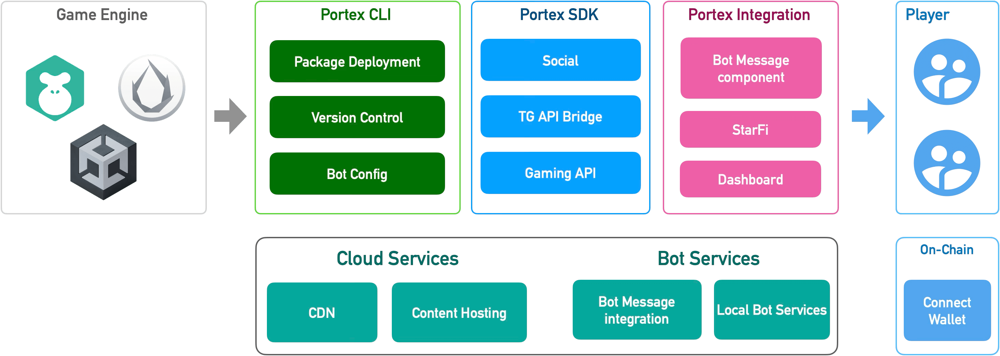

# 简介

## 什么是 Portex？

Portex 集成了 Bot-as-a-Service 服务，实现**一键式小游戏部署**到多个平台，减少超过 90% 的跨平台兼容性工作。

## 优势

* 轻松发布小游戏，学习曲线低
* 与 Telegram 等平台无缝集成
* 区块链集成、好友推荐系统、Telegram StarFi 等功能

## 主要特性

* **一键部署**：一键将小游戏部署到多个平台，降低分发成本
* **Bot 即服务**：为游戏提供无缝的社区管理服务，实现自动化用户互动
* **Web3 游戏**：集成去中心化身份验证和数字钱包功能，确保安全认证和流畅交易
* **变现功能**：集成 StarFi 实现游戏内购买和提现
* **游戏功能**：排行榜、游戏存档、邀请等

## 展示案例

<figure><figcaption>
<strong>AirForce 1945</strong>
</figcaption></figure> <figure><figcaption>
<strong>Mini Football Game</strong>
</figcaption></figure> <figure><figcaption>
<strong>Mad Wheels</strong>
</figcaption></figure>

* **AirForce 1945** [https://t.me/AirForce1945\_bot/game](https://t.me/AirForce1945_bot/game)
* **Mini Football** [https://t.me/miniFootballgame\_bot?startapp=portex](https://t.me/miniFootballgame_bot?startapp=portex)
* **MadWheels** [https://t.me/MadWheels\_bot](https://t.me/MadWheels_bot)

🎮 [查看更多...](getting-started/showcase.md)

## 如何使用？

1. 首先，使用 [portex cli](cli/overview.md) 创建、部署和发布新的小游戏
2. 集成 [portex sdk](sdk/overview.md) 来开发您的小游戏

更多详情请查看[工作流程](getting-started/workflow.md)

## 联系我们

<figure><figcaption></figcaption></figure>

[https://www.televerse.xyz/](https://www.televerse.xyz/)

[https://t.me/televerseadmin](https://t.me/televerseadmin)

[https://x.com/televerseXYZ](https://x.com/televerseXYZ)

[https://github.com/portex-app](https://github.com/portex-app)

[mailto:official@teletypes.io](mailto:official@teletypes.io)

## 更多主题

<table data-view="cards"><thead><tr><th></th><th data-type="content-ref"></th></tr></thead><tbody><tr><td>使用 portex 构建小游戏</td><td><a href="getting-started/workflow.md">workflow.md</a></td></tr><tr><td>如何使用 portex cli</td><td><a href="cli/overview.md">overview.md</a></td></tr><tr><td>关于 Portex SDK</td><td><a href="sdk/overview.md">overview.md</a></td></tr></tbody></table>
