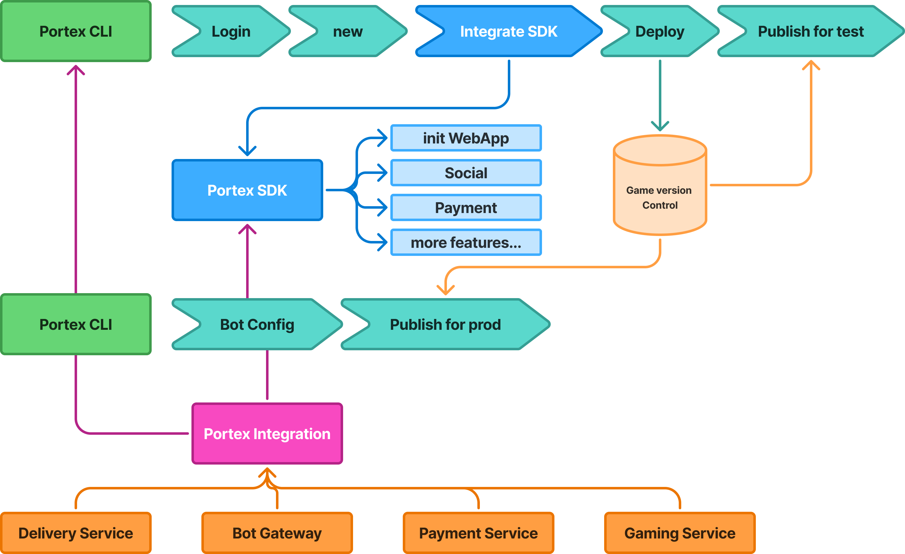

# Portex Workflow



## 1. deploy a mini-game for testing
 * install portex cli
 ```bash
 npm install -g @portex-app/cli
 ```
 * run `portex new` to create a new mini-game
 * run `portex deploy` to deploy a mini-game for testing

 more details in [Use CLI](guides/cli.md)


## 2. create a bot in Telegram
* open telegram and search @BotFather
* start /newbot in chat
* set a name for your bot
* get the bot token

## 3. configure bot in Portex
* use `portex bot` to configure bot
* run `portex bot register <app-name> <bot-token>` to register bot

## 4. integrate your mini-game with Portex SDK

* import https://sdk.portex.app/portex-sdk.min.js to your mini-game
* you can run `portex ls` to list all your mini-games with app-id
* initialize Portex SDK with your app-id

```javascript
const portex = new Portex({
  appId: 'your-app-id',
});

const result = await sdk.init();
```

more details in [Portex SDK](sdk/overview.md)

## 5. publish your mini-game for production
* run `portex publish` to publish your mini-game for production

